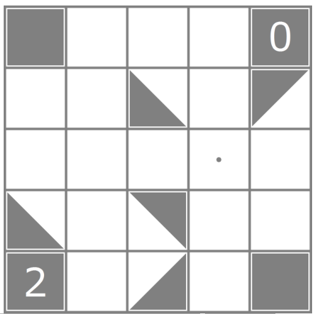
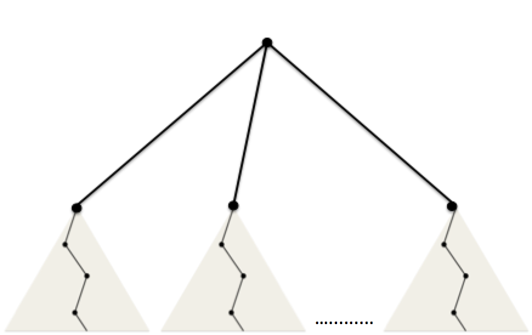
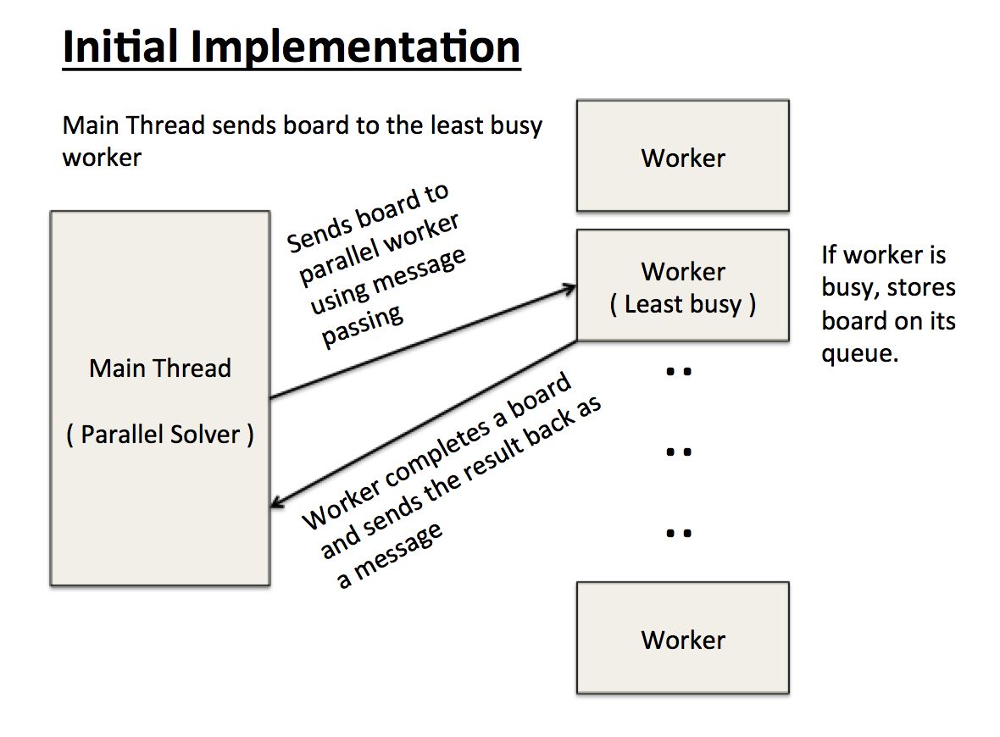
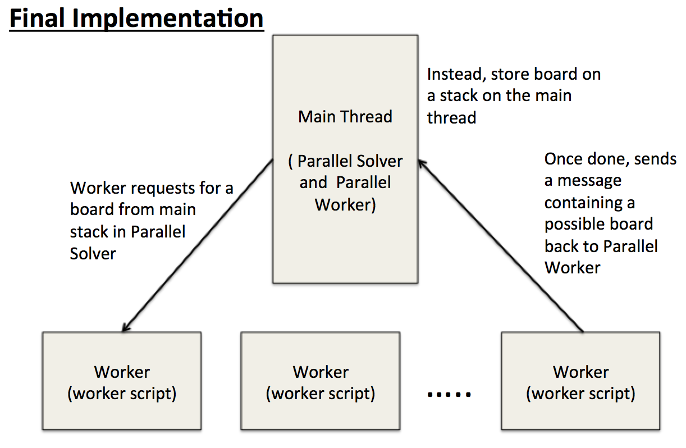
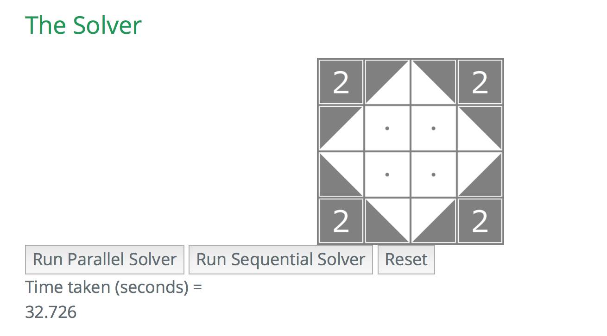
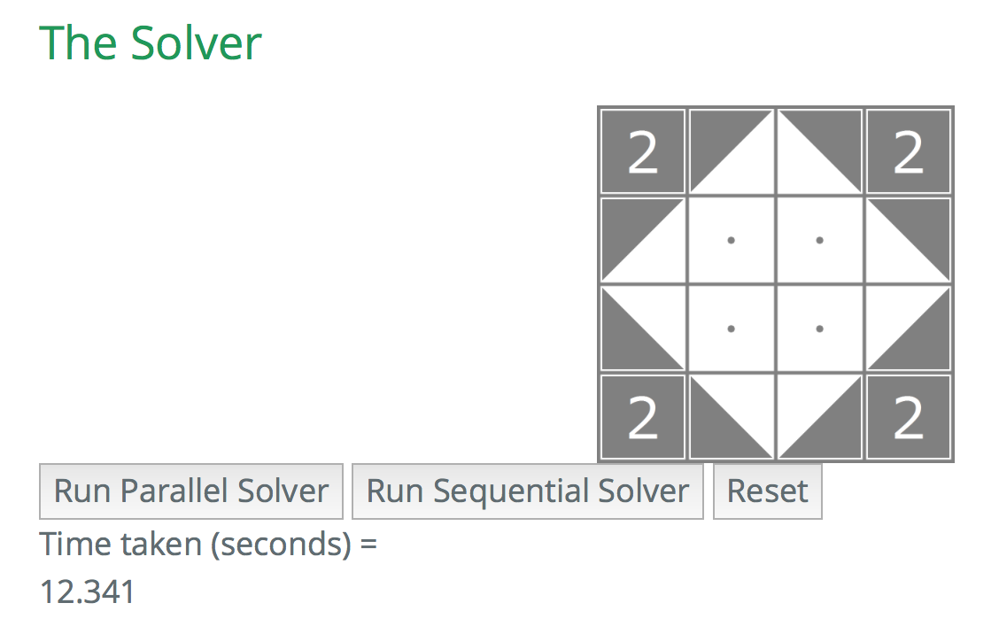
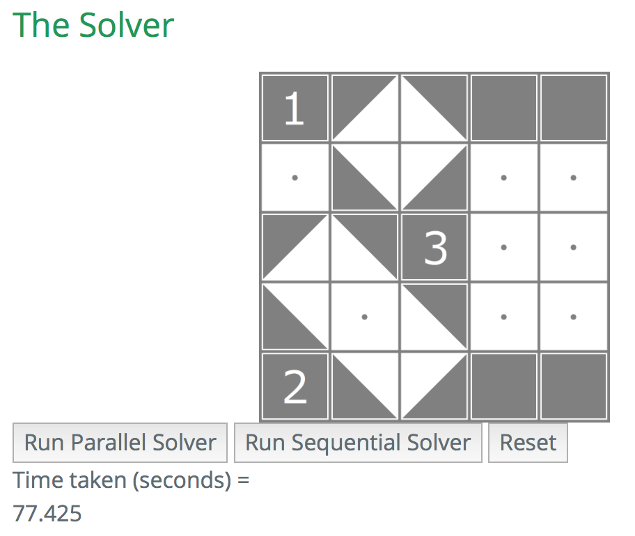
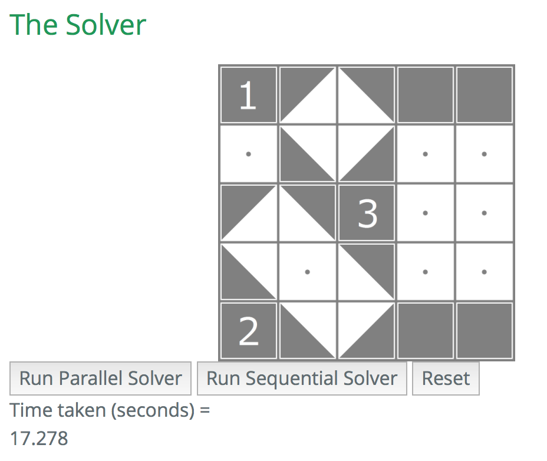

#418 Final Report

##Summary

Our project is to implement a parallel solver for a NP-complete puzzle called Shakashaka using JavaScript web workers. The deliverable is a web application hosted locally on the client's machine which will use the whatever processing abilities on the individual's computer.

Our aim was to achieve a 2-3x speedup over the sequential version on our dual-core processor with hyperthreading.

##Background

There are 3 main parts to our program:

###1) Sequential solver

The solver takes in a solvable Shakashaka board (a 2-D array of numbers) and returns a board which is solved. The algorithm first fills the deducible squares of the board (usually indicated by black squares with numbers). Then it calls the isSolved() function (described below) to check if the board is solved, otherwise it will call mayBeSolvable() function to check if such a board configuration can actually be solved, before calling seqSolveByGuessing(), which brute-force fills the board with all possible squares, and sees if it generates a valid solution. Afterwards, it will keep repeating the process till it reaches a board configuration that isSolved() returns true.

###2) Sequential board checker

The key part of this application relies on the checker to determine if the board is either solved or is possible to solve.

For the isSolved( *some\_board_configuration* ) function, the algorithms checks the sides and corners for invalid configurations. For the inner squares, we use the validBlock() function which calculates the inner angle of a 2 by 2 sub-block. For example, let consider a 2 by 2 block of squares. We divide each square into 4 smaller triangles such as:

	\ 0 /
	1 x 3
	/ 2 \

So for each square in the 2 by 2 sub-block, we can reduce the problem into a sequence of 8 T/F values (Eg. TFFTFFFT) for each sub-block. T (true) indicates the smaller triangle is black while F (false) indicates the smaller triangle is white. Each T contributes a 45 degree angle to the sub-block. We eliminate boards with invalid angles such as 45,135,215 and so on. Only 0,90,180 and 360 angles are allowed in any solved board. So our algorithm basically calculates all angles in the sub-block and determine if each satisfies the solved board criteria.

For the mayBeSolvable( *some\_board_configuration* ), it checks if the board is even actually solvable at all (returns true if possible to solve, otherwise false). It is almost similar to the isSolved() function except now it checks each side and angle with a different set of criterions. For sides, only boards with 45 degree angles are eliminated. It will also run the same validBlock() but with a different set of checks.

###3) Parallel solver

The parallel solver parallelizes parts of the sequential algorithm that are parallelizable. This solver utilizes one main thread which communicates with the client, distributes tasks to worker threads, and does the sequential part of the algorithm; and a fixed number of web workers on different threads working on the parallelizable part of the algorithm.

The initial part of the algorithm, in which all the deducible squares are filled in, is done sequentially by the main thread (because filling in one square might allow us to deduce another). Then, we come to a point where we have numerous possible ways to fill in the remaining unfilled squares. At this point the main thread generates numerous copies of the board in which one of such squares is filled with one possible tile. Then those boards are sent to worker threads, who determine whether the given board is solvable using the sequential solver.

When a worker thread finds a solved configuration, it passes that solution onto the main thread, which signals all the worker threads to terminate, and calls the callback function designated by the client.

##Approach

The program is written in TypeScript (JavaScript with static typing).

We use web workers to achieve parallelism on the client side browser.

(All code is written from scratch)

Web workers use message passing in which the main thread and worker threads send JavaScript objects to each other (but not between workers). The diagram below explains the mechanics.

Our initial sequential solver brute force tries every possible board configuration and uses isSolved() to verify every board. Obviously, this implementation is very slow and can only solve a 3 by 3 board within a reasonable amount of time. Before we can parallelize the solver, we need to shave down number of impossible to solve configurations so that the size of our recursion tree becomes smaller. Also mapping an impossible configuration to a thread on a core will result in wasted computation.

So we next limited our guesses to those that are "sensible" - e.g. it wouldn't make sense to put triangles in a way that forms white areas with 45-degree corners. This reduced the number of paths we had to search into.

Furthermore, we implemented a mayBeSolvable() to remove boards that can never be solved (Example above 2nd row last column has a triangle in the wrong orientation). Now a partially solved 4 by 4 board can be solved in a reasonable amount of time.

Now to distribute the work over parallel workers.

We use the web workers to statically distribute work onto the processing cores on the clients computer. We are not parallelizing over a board (since small boards already takes a long time to solve using brute force along) but instead, when running the solver algorithm, we generate a tree of board configurations. So in the first iteration of the algorithm, a tree with multiple subtrees are generated. And at the root of each subtree is a board configuration. Then we assign each subtree (or will be a subtree of configurations) to available workers in the worker pool.

Each black dot represents a board configuration.

At any point in time as the algorithm runs, the traversal of the stack tree yields a sequence of boards in a single branch - in other words, although the running time of the brute force algorithm is exponential, the amount of memory used is based on the number of nodes along the path of traversal (as shown in the diagram) so is relatively small compared to the size of the tree. Hence, there was not much locality we can exploit here since the number of memory accesses pales in comparison to the amount of computations performed by the sequential solver. And every time a branch ends (reached an invalid board configuration), all the memory is deallocated automatically. Each board configuration at each node is unique, so caching is not useful.

(static distribution)

The main threads assign a board to the least busy worker based on the number of boards on each worker's queue. This was not good since each board configuration yields a different size subtree of configurations and may not balance the workload evenly enough among the parallel workers. Each parallel worker has a **queue** to store board configurations. So while a single worker is still working on a board, any board pass from the main thread to the worker (as a message) is stored on the queue till the worker is freed from its current work.

So we decided to modify the Parallel Solver to remanage the distribution of work.

So instead, we put a main stack storing each board configuration in the main thread (parallel solver).

(Dynamic Distribution)

The main thread initially assigns possible to solve boards to available worker threads. Then all other boards will put on the main thread's stack. Once the worker has completed checking a board, it will pop another board from the main stack and repeat the process (via message passing).

So rather than performing work in its own queue, the worker will request a new board whenever it finishes its task.

**NOTE**: although it may seem the workers seem to be contending for the top of the stack, it actually does not. This is because the individual workers have to send a message to the main thread (parallel worker) in which the main thread distributes the work in a sequential manner. Thus no locking is required to ensure the correctness of the program.

##Results (final implementation)

All tests are run on a Macbook Pro with a 2.7GHz dual-core Intel Core i5 processor. So there are 2 cores with 4 execution contexts on each machine. For each test, we timed the execution of the sequential and parallel functions separately, each time on a new opened browser. We spawned 10 threads more than the total execution contexts to attain some hyperthreading.

###Sequential (one thread)

###Parallel (ten threads)

###Sequential (one thread)

###Parallel (ten threads)

For the sample 4 by 4 board, we have achieved a speedup of roughly ~2.66  over the sequential version.
For the sample 5 by 5 board, the speedup achieved was about ~4.5 over the sequential version.

Depending on the initial board configurations, the speedup will vary since the size of the recursion tree will be different for each board.

A key thing to note here is the performance of this program is dependent of the number of threads running on your operating system. If there are too many running threads (Eg. you opened many tabs or another browser such as Chrome), the speedup of the program will be reduced. This is because many threads will increase the overhead over the CPU's finite execution resources. So it is recommended that it to run this program on a single browser with as little opened applications as possible.

A key problem in our parallel implementation was that we did not kill all the web workers properly, as a result, the pool of workers accumulated overtime and this limited our performance gain.

###Various number of workers
We ran the parallel solver on three different solvable boards with 2, 4, 8, and 16 workers:

| # of workers  | Board 1       | Board 2  | Board 3 |
| :-------------:| -------------:| -----:| -----: |
| 2      | 6.0s | 10.0s | 12.0s |
| 4      | 7.4s      |   11.2s | 7.0s |
| 8 | 9.0s      |    12.6s | 7.8s |
| 16 | 11.6s      |    15.6s | 10.0s |

On our dual-core (two hyper-threads per core) laptop, the fastest times were obtained when we were using two or four workers, and it got gradually slower as we increased the number of workers to 8 or 16 (but still much faster than the sequential implementation).

We believe that the reason why using 8 or 16 workers (and sometimes 4) was generally slower than using fewer workers was thrashing. Since workers do not share their data, each worker requires a different set of data in the cache (and it can be big if the worker is deep into a search path). Hence using more workers than the number of physical cores available worsened the performance of our solver.

As for the two-worker solver being way more than twice as fast as the sequential worker, this is due to the fact that either solver terminates whenever it finds one solved configuration, and depending on where the solutions are in the search tree, they could be discovered much faster in the parallel solver (because multiple workers are searching different parts of the search tree).
