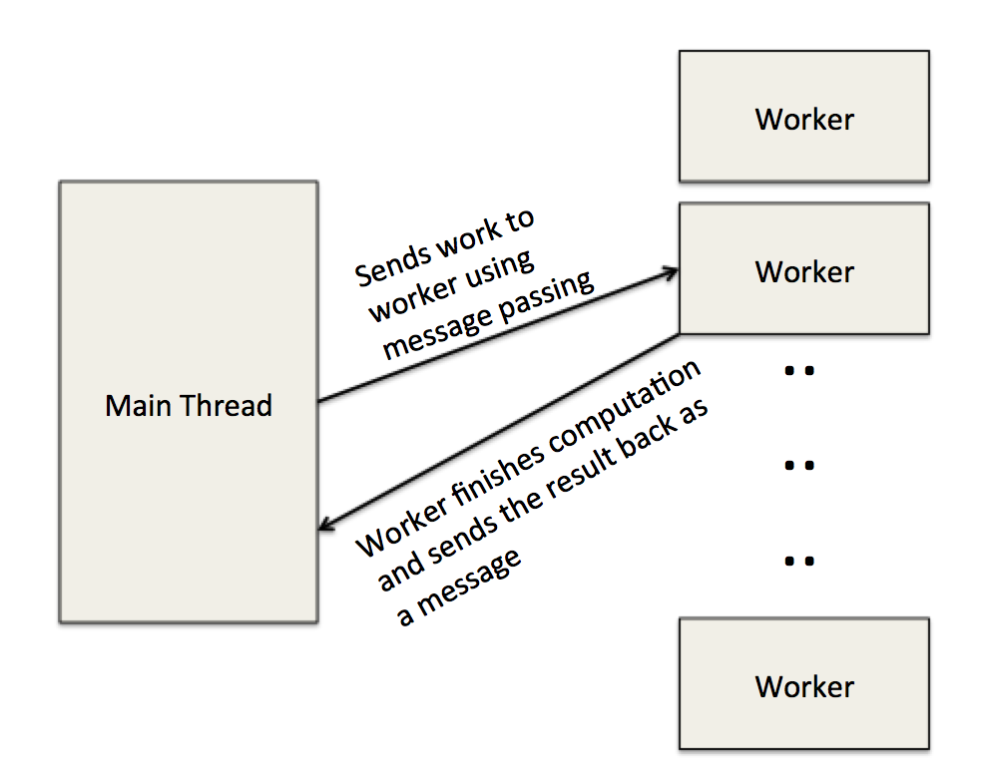

#418 Final Report

##Summary

Our project is to implement a parallel solver for a NP-complete puzzle called Shakashaka using Mozilla Developer Network (MDN) web workers. The deliverable is a web application hosted locally on the client's machine which will use the whatever processing abilities on the individual's computer. 

We aim to achieve a 2-3x speedup over the sequential version. 

##Background

There are 3 main parts:

###1) Sequential solver

The solver takes in a solvable Shakashaka board (a 2-D array of numbers) and returns a board which is solved. The algorithm first fills the deducible squares of the board (usually indicated by black squares with numbers). Then it calls the isSolve() function to check if the board is solved, otherwise it will call mayBeSolvalbe() function to check if such a board configuration can actually be solved, before calling seqSolveByGuessing(), which brute-force fills the board with all possible squares. Afterwards, it will keep repeating the process till it reaches a board configuration that isSolved() returns true. 

The algorithm runs recursively and hence all board configurations are stored on the stack which is on the RAM (unless memory overloads then it uses the hard disk, but we will not go there).  

###2) Sequential board checker 

The key part of this application relies on the checker to determine if the board is either solved or is possible to solve. 

For the isSolved( *some\_board_configuration* ), the algorithms checks the sides and corners for invalid configurations. For the inner squares, we use the validBlock() function which calculates the inner angle of a 2 by 2 sub-block. For example, let consider a 2 by 2 block of squares. We divide each square into 4 smaller triangles such as:

	\ 0 /
	1 x 3
	/ 2 \

So for each square in the 2 by 2 sub-block, we can reduce the problem into a sequence of 8 T/F values (Eg. TFFTFFFT) for each sub-block. T (true) indicates the smaller triangle is black while F (false) indicates the smaller triangle is white. Each T contributes a 45 degree angle to the sub-block. We eliminate boards with invalid angles such as 45,135,215 and so on. Only 0,90,180 and 360 angles are allowed in any solved board. So our algorithm basically calculates all angles in the sub-block and determine if each satisfies the solved board criteria.

For the mayBeSolvable( *some\_board_configuration* ), it checks if the board is even actually solvable at all (returns true if possible to solve, otherwise false). It is almost similar to the isSolved() function except now it checks each side and angle with a different set of criterions. For sides, only boards with 45 degree angles are eliminated. It will also run the same validBlock() but with a different set of checks.

###3) Parallel Workers

And the last main part involves writing a parallel worker script using a stack data structure that is used in the main thread. 

####What parts stand to gain from parallelization?

##Approach

The program is written in typescript (fancy javascript).
We use the MDN web workers to distribute work onto the clients . 

##Results

